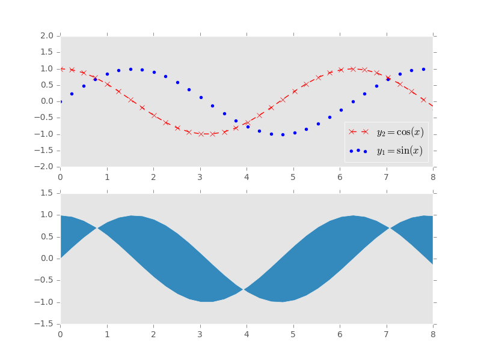

# `rustplotlib` [](https://crates.io/crates/rustplotlib) [](https://docs.rs/rustplotlib) [](https://travis-ci.org/ubnt-intrepid/rustplotlib)

A tiny library for creating 2D charts, by using matplotlib.

This project is inspired by mneumann's [matplotlib-rs](https://github.com/mneumann/matplotlib-rs),
 and SiegeLord's [RustGnuplot](https://github.com/SiegeLord/RustGnuplot).

__WARNING__

This project is currently under the development.
It means that some broken changes will be occurred in API.

The development version of API documentation is [here](https://ubnt-intrepid.github.io/rustplotlib/rustplotlib/).

## Features
* builder style API
* support for multiple backends

## Example

```rust
extern crate rustplotlib;

use rustplotlib::Figure;

fn make_figure<'a>(x: &'a [f64], y1: &'a [f64], y2: &'a [f64]) -> Figure<'a> {
  use rustplotlib::{Axes2D, Scatter, Line2D, FillBetween};

  let ax1 = Axes2D::new()
    .add(Scatter::new(r"$y_1 = \sin(x)$")
      .data(x, y1)
      .marker("o"))
    .add(Line2D::new(r"$y_2 = \cos(x)$")
      .data(x, y2)
      .color("red")
      .marker("x")
      .linestyle("--")
      .linewidth(1.0))
    .xlabel("Time [sec]")
    .ylabel("Distance [mm]")
    .legend("lower right")
    .xlim(0.0, 8.0)
    .ylim(-2.0, 2.0);

  let ax2 = Axes2D::new()
    .add(FillBetween::new()
      .data(x, y1, y2)
      .interpolate(true))
    .xlim(0.0, 8.0)
    .ylim(-1.5, 1.5);

  Figure::new()
    .subplots(2, 1, vec![Some(ax1), Some(ax2)])
}

fn main() {
  use std::f64::consts::PI;
  let x: Vec<f64> = (0..40).into_iter().map(|i| (i as f64) * 0.08 * PI).collect();
  let y1: Vec<f64> = x.iter().map(|x| x.sin()).collect();
  let y2: Vec<f64> = x.iter().map(|x| x.cos()).collect();

  let fig = make_figure(&x, &y1, &y2);

  use rustplotlib::Backend;
  use rustplotlib::backend::Matplotlib;
  let mut mpl = Matplotlib::new().unwrap();
  mpl.set_style("ggplot").unwrap();
  
  fig.apply(&mut mpl).unwrap();
  
  mpl.savefig("simple.png").unwrap();
  mpl.dump_pickle("simple.fig.pickle").unwrap();
  mpl.wait().unwrap();
}
```



See [examples/simple.rs](examples/simple.rs) for details.

## License
This software is released under the MIT license.
See [LICENSE](LICENSE) for details.
